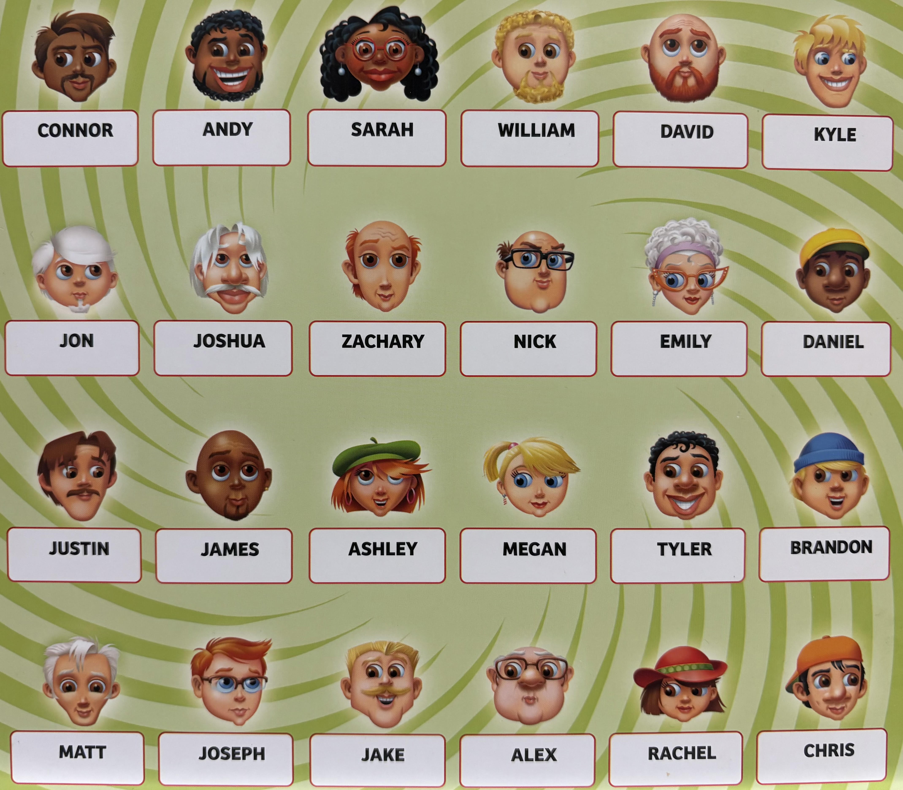

# Guess Who?

A desktop **Guess Who?** game built in **Java** with a **Swing GUI**. Pick a secret character, ask yes/no questions, eliminate candidates, and make the final guess.

> Repo includes core classes like `GuessWho.java`, `AIPlayer.java`, and `GameChar.java`, plus image assets for the board/UI. :contentReference[oaicite:1]{index=1}

---

## Features
- **Java Swing GUI** game interface
- **Character board** with visual assets/icons
- **Object-oriented design** with dedicated classes for game characters and gameplay logic
- **AI opponent support** (see `AIPlayer.java`) :contentReference[oaicite:2]{index=2}
- Extra folders/assets included for extending the character set and UI :contentReference[oaicite:3]{index=3}

---

## Demo / Screenshot


---

## How to Run

### Option A — Run in an IDE (recommended)
1. Clone the repo:
   ```bash
   git clone https://github.com/Blueblitz135/Guess-Who-.git
   cd Guess-Who-
